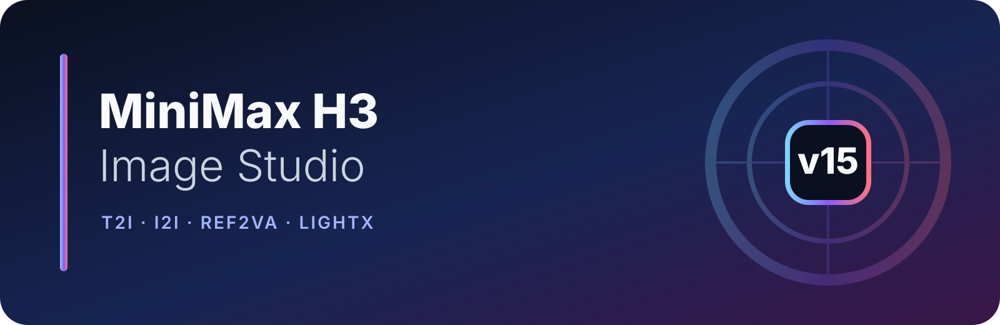
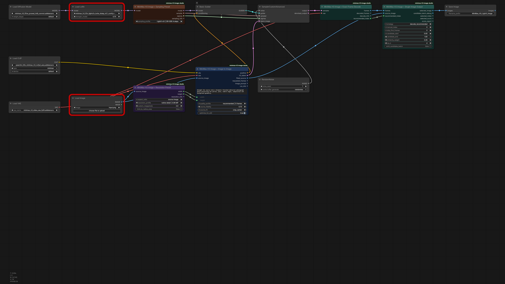

# MiniMax H3 Image Studio v15

Image-first [ComfyUI](https://github.com/Comfy-Org/ComfyUI) nodes and documented workflows for using [MiniMax H3](https://huggingface.co/MiniMaxAI/MiniMax-H3) as a practical text-to-image, image-to-image and REF2VA reference-edit system.

> [!WARNING]
> This is an experimental, AI-assisted community project. MiniMax H3 image use is adapted from a native audio-video model, and upstream implementations are still changing. Keep a copy of working workflows when updating ComfyUI or third-party acceleration nodes.

> [!IMPORTANT]
> **Community GPU validation is requested for v15.** The release passed code, ComfyUI import, prompt, workflow, frontend, PNG metadata and runtime-unit checks, but the maintainer is away from the CUDA workstation for approximately one week and could not run a complete production-weight generation before publication. Please share successful tests as well as failures in [validation issue #13](https://github.com/astropuzzo/ComfyUI-MiniMax-H3-Image-Studio/issues/13).

## v15 at a glance

- Fixes the reported **Empty canvas** problem by shipping real ComfyUI UI workflows, not only API prompt JSON.
- Adds four 3200×1800 PNG workflow previews. Every PNG embeds both `workflow` and `prompt` metadata and can be dragged into ComfyUI.
- Adds four editable `Workflow Note` cards to every UI workflow: quick start, models, settings rationale and optional/experimental paths.
- Connects `Exact Frame Decode.recommended_index` directly to `Single Image Output`; the default no longer blindly skips frame 0.
- Keeps the old decoder output order intact and appends the new recommendation as output 4, so existing links do not shift.
- Replaces ambiguous generic Turbo choices with adapter-specific **LightX v0.1** ER-SDE and SA-Solver recipes.
- Preserves the v14 `audio_scale` fix on current ComfyUI and includes an AV compatibility shim for older `ModelSamplingDiscreteFlow` builds.
- Adds coordinated node colors, wider node cards, new branding, Registry metadata, automated artifact validation and GitHub CI.

See [CHANGELOG.md](CHANGELOG.md) for the complete release history.

## Installation

ComfyUI 0.30.0 or newer is required; the latest stable ComfyUI is strongly recommended for H3, ER-SDE/SA-Solver and experimental quantized checkpoints.

### ComfyUI Manager and Registry

The package is prepared for publication under the Registry id `minimax-h3-image-studio`. Once its Registry entry is visible, search for **MiniMax H3 Image Studio** in ComfyUI Manager or install it with:

```bash
comfy node install minimax-h3-image-studio
```

Registry installations expose stable semantic versions to ComfyUI Manager, allowing users to discover and select updates instead of depending on GitHub visits.

### Git installation

```bash
cd ComfyUI/custom_nodes
git clone https://github.com/astropuzzo/ComfyUI-MiniMax-H3-Image-Studio.git
```

Restart ComfyUI after installing or updating. Image Studio has no additional Python runtime dependencies: it uses the PyTorch and H3 support already supplied by ComfyUI.

### Updating from v5–v14

An already-installed old release cannot display a notification that was not built into that release. The update path depends on how it was installed:

- **Git clone:** use ComfyUI Manager's update function where available, or run `git pull --ff-only` inside `ComfyUI/custom_nodes/ComfyUI-MiniMax-H3-Image-Studio`, then restart ComfyUI.
- **ComfyUI Manager/Registry:** after the Registry publication is active, use the Manager's **Update** filter and select the latest stable version.
- **Downloaded ZIP:** ZIP installations have no Git history or automatic updater; replace the old folder with a fresh release and restart ComfyUI.

Back up custom workflows before moving across major versions. The bundled v15 workflows live in `examples/ui/` and `examples/png/`.

## Ready-to-open workflows

Use a UI JSON or drag its PNG directly onto the ComfyUI canvas. API JSON files remain available for programmatic clients and are intentionally stored in a separate directory.

| Workflow | UI workflow | PNG with metadata | API prompt | Checkpoint family |
|---|---|---|---|---|
| Text to Image | [JSON](examples/ui/H3_T2I.json) | [PNG](examples/png/H3_T2I.png) | [API](examples/api/H3_T2I_API.json) | FL2VA |
| Image to Image | [JSON](examples/ui/H3_I2I.json) | [PNG](examples/png/H3_I2I.png) | [API](examples/api/H3_I2I_API.json) | FL2VA |
| Reference Edit | [JSON](examples/ui/H3_REFERENCE_EDIT.json) | [PNG](examples/png/H3_REFERENCE_EDIT.png) | [API](examples/api/H3_REFERENCE_EDIT_API.json) | REF2VA |
| I2I · LightX v0.1 | [JSON](examples/ui/H3_I2I_LIGHTX_TURBO.json) | [PNG](examples/png/H3_I2I_LIGHTX_TURBO.png) | [API](examples/api/H3_I2I_LIGHTX_TURBO_API.json) | FL2VA + LightX LoRA |



The PNGs are previews, portable workflows and recovery artifacts at the same time. Their metadata is checked in CI against the corresponding UI and API JSON, preventing silent drift between formats.

## Nodes

| Node | Purpose |
|---|---|
| `Text to Image` | Builds FL2VA conditioning and the packed H3 latent for still generation. |
| `Image to Image` | Uses an FL2VA first-frame source anchor for instructed editing. |
| `Reference Edit` | Builds REF2VA conditioning from one source plus up to eight ordered donor references. |
| `Resolution Preset` | Selects aspect ratio and 0.4–8 MP presets on H3's 32-pixel grid. |
| `Sampling Preset` | Applies explicit base or LightX v0.1 recipes. |
| `Exact Frame Decode` | Preserves the requested 5/9/13/20-frame context and reports a mode-aware still index. |
| `Single Image Output` | Uses that recommendation by default, or ranks frames with optional metrics. |
| `Advanced Resolution` | Exposes manual canvas, megapixel and native-area controls. |
| `Advanced Sampling` | Exposes sampler, scheduler, denoise, beta schedule and AV sigma shifts. |
| `Advanced Combined Prepare` | Combines T2I, I2I and REF2VA preparation in one advanced node. |
| `Workflow Note` | Non-executing editable documentation card used by the bundled UI workflows. |

All generation nodes include descriptions and control-level tooltips. Image Studio nodes are color-coded by role: preparation, sampling, output and documentation.

## Models and folders

Follow the [official ComfyUI MiniMax H3 guide](https://docs.comfy.org/tutorials/video/minimax/minimax-h3) and obtain weights from [Comfy-Org/MiniMax-H3](https://huggingface.co/Comfy-Org/MiniMax-H3) or another trusted publisher.

| Component | Example filename | Folder |
|---|---|---|
| FL2VA diffusion model | `minimax_h3_fl2va_pruned_int8_convrot.safetensors` | `ComfyUI/models/diffusion_models/` |
| REF2VA diffusion model | `minimax_h3_ref2va_pruned_int8_convrot.safetensors` | `ComfyUI/models/diffusion_models/` |
| Qwen text encoder | `qwen3vl_32b_minimax_h3_nvfp4_awq.safetensors` | `ComfyUI/models/text_encoders/` |
| H3 video VAE | `minimax_h3_video_vae_fp16.safetensors` | `ComfyUI/models/vae/` |
| LightX v0.1 LoRA | `minimax_h3_fl2v_lightx2v_turbo_4step_v0.1_comfy.safetensors` | `ComfyUI/models/loras/` |

The audio VAE is not needed: Image Studio retains H3's internal AV sampling contract but decodes and saves only the video/image stream.

Filename variants change over time. If your trusted download uses a different name, select it in the relevant loader instead of renaming it solely to match an example.

## Frame profiles and still selection

H3 jointly denoises a temporal packet even when the desired result is one image. The frame profile is therefore generation context—not the number of final files that must be saved.

| Profile | Frames kept | Use |
|---|---:|---|
| `recommended | 5 frames` | 5 | Default and best-tested image balance. |
| `extended quality | 9 frames` | 9 | Intermediate temporal context. |
| `high quality | 13 frames` | 13 | Larger context at higher memory/time cost. |
| `maximum quality | 20 frames (slow)` | 20 | Maximum exposed image profile; substantially slower. |

`Exact Frame Decode` removes only natural VAE packet surplus and emits the complete requested profile. It also returns `recommended_index`:

- T2I, REF2VA and standard short I2I start conservatively at frame 0.
- Twenty-frame FL2VA I2I may use the first measured stable-edit frame.
- The recommendation is calculated per decoded batch item; the scalar output describes the first item, which is the normal workflow case.

`Single Image Output` defaults to `decode_recommended`. It also offers `first`, fixed indices, sharpness/quality metrics, source similarity and balanced scoring. Metric selection can be useful for inspection, but it cannot repair weak edit conditioning: a sharp frame can still be the wrong edit.

`emit_candidate_batch = true` sends the complete decoded profile through `selected_image`; `top_k` limits only the diagnostic candidate output. This intentionally uses more RAM/VRAM.

## Base and LightX sampling recipes

| Profile | Sampler | Scheduler | Steps | H3 shifts | Dependency |
|---|---|---|---:|---:|---|
| `base quality | RES 20 steps` | `res_multistep` | `simple` | 20 | 12/3 | Base H3 |
| `base speed | RES 12 steps` | `res_multistep` | `simple` | 12 | 12/3 | Base H3 |
| `LightX v0.1 | ER-SDE 4 steps` | `er_sde` | `simple` | 4 | 12/3 | Matching LightX v0.1 LoRA |
| `LightX v0.1 | SA-Solver 4 steps` | `sa_solver` | `simple` | 4 | 12/3 | Matching LightX v0.1 LoRA |

The LightX workflow follows the current [Kijai MiniMax-H3 Comfy model card](https://huggingface.co/Kijai/MiniMax-H3_comfy): the Comfy-format v0.1 LoRA, strength `0.75`, four steps and either ER-SDE or SA-Solver with the simple scheduler.

The Sampling Preset loads no adapter by itself. The matching LoRA must be connected upstream through `LoraLoaderModelOnly`. Old v14 profile strings remain at the bottom of the combo for saved-workflow compatibility, but the generic Turbo labels are deprecated because they do not identify a training recipe.

## Larry Turbo is a separate implementation

[Larryvrh/ComfyUI-MiniMax-H3-Turbo](https://github.com/Larryvrh/ComfyUI-MiniMax-H3-Turbo) is not interchangeable with LightX. Its original/pruned adapters can require its own `MiniMaxH3TurboLoRA` loader and `MiniMaxH3TurboSampler` because time-conditioning and pruning details are part of that implementation.

At the time of this release, its documentation recommends the v4 step-600 checkpoint for most work, usually 4–8 steps and strength `1.0`, with 6–8 steps favored when quality matters. Use that project's current workflow and settings rather than selecting a LightX preset in Image Studio.

## What is useful from Kijai's current work

[ComfyUI-KJNodes](https://github.com/kijai/ComfyUI-KJNodes) now contains several H3-specific or H3-relevant optimizations that can be placed upstream of Image Studio without becoming hard dependencies:

- MiniMax H3 memory-efficient SageAttention patch;
- low-VRAM attention through head grouping;
- chunked MiniMax feed-forward execution;
- recent SageAttention padding/device fixes for newer GPU architectures;
- H3 Tiny VAE model-preview override.

These patches are optional because their value depends on GPU architecture, CUDA/PyTorch/SageAttention build, resolution and frame count. Keep the standard workflows working first, then add one optimization at a time and compare output and peak memory.

Kijai's [MiniMax-H3 TAE](https://huggingface.co/Kijai/MiniMax-H3-TAE) (`taeh3.safetensors` in `models/vae_approx`) is for lightweight previews, not the final H3 decode. The [experimental H3 repository](https://huggingface.co/Kijai/MiniMax-H3-experimental) also includes w4a8 diffusion models and an int8 conv-rotation VAE. They are promising memory options, but are deliberately documented as experimental rather than substituted into the standard release workflows.

Two r/StableDiffusion threads also informed the conservative defaults: the original [experimental image-node discussion](https://www.reddit.com/r/StableDiffusion/comments/1veh31j/experimental_minimax_h3_image_nodes_for_comfyui/) repeatedly found short packets and the first frame useful, while a later [4090 attention comparison](https://www.reddit.com/r/StableDiffusion/comments/1vg9b7l/minimax_h3_testing_with_4090_with_different_nodes/) reported promising H3-specific memory-efficient SageAttention results. These are valuable community observations, not universal benchmarks; v15 exposes the choices without forcing them.

## Reference-edit guidance

REF2VA regenerates from ordered visual references; it is not a pixel-locked compositing tool. A reliable two-image instruction makes ownership explicit:

```text
Keep the person, face, body, pose, camera angle, framing and background from <Picture 1>.
Replace only [named feature] using <Picture 2>. Preserve every other element from <Picture 1>.
Return one sharp finished photograph.
```

`source_fidelity` strengthens preservation language in the prompt. It is not a denoise slider and cannot guarantee identity or geometry by itself. Adding references without assigning each one a specific role can increase ambiguity.

## AV sampling compatibility

MiniMax H3 keeps packed audio and video latents during denoising. Image output still requires an `audio_scale`-aware sampling object.

On current ComfyUI, Image Studio subclasses native `ModelSamplingAV` and preserves video shift, audio shift, multiplier and noise scale. On older compatible cores where that class is absent, v15 supplies the same `audio_scale = video_shift / audio_shift` contract on top of `ModelSamplingDiscreteFlow`. `sampling_info` reports which backend was used.

Update ComfyUI first if H3 itself, ER-SDE/SA-Solver or a new quantized checkpoint is unavailable; the shim is compatibility protection, not a replacement for upstream model support.

## Resolution and memory

Resolution uses ComfyUI's convention of `1 MP = 1024² pixels` and rounds to H3's 32-pixel grid. `limit_to_native_area` provides a conservative cap around the model's native training area.

Direct 2/4/8 MP generation is exposed for experimentation, but H3-Base is not the unreleased H3-Regenerate-2K pipeline. More canvas pixels can sharply increase attention, decode, RAM and pagefile cost without proportional learned detail.

Historical 24 GB RTX 4090 measurements from the base workflow are retained only as rough scaling context:

| Resolution | Frames requested | Natural packet | 20-step time |
|---:|---:|---:|---:|
| 1.99 MP | 5 | 5 | 27.8 s |
| 1.99 MP | 20 | 22 | 50.1 s |
| 3.96 MP | 5 | 5 | 38.9 s |
| 3.96 MP | 20 | 22 | 138.6 s |
| 8.02 MP | 5 | 5 | 84.0 s |
| 8.02 MP | 20 | 22 | 401.8 s |

These are not LightX benchmarks. Actual performance varies with model format, GPU, attention backend, frame profile, adapter and system memory.

## Validation performed for v15

- Clean import and node-definition check in ComfyUI 0.31.0 on CPU.
- Real current-frontend conversion of all four API workflows into schema-0.4 UI workflows.
- Real frontend rendering of all four PNG previews.
- Metadata round-trip checks proving each PNG contains its matching workflow and prompt.
- Runtime tests for decoder output compatibility, recommendation wiring, LightX recipes and the pre-`ModelSamplingAV` shim.
- Dependency-free GitHub CI for Python syntax and every API/UI/PNG artifact relationship.

Full image generation was not run in the CPU-only release environment because the production H3/Qwen weights and CUDA GPU are required. Please include hardware and exact model details in generation bug reports.

## Troubleshooting and bug reports

If a workflow opens empty, verify that you used a file from `examples/ui/` or one of the PNGs—not an API file from `examples/api/`.

For generation issues, attach:

- ComfyUI version or commit;
- Image Studio version;
- GPU, VRAM, system RAM and operating system;
- checkpoint, text encoder, VAE and adapter filenames;
- adapter strength;
- T2I, I2I or REF2VA mode;
- resolution and frame profile;
- sampling profile or explicit sampler/scheduler/steps/shifts;
- workflow JSON or metadata PNG;
- complete console traceback.

Use [GitHub Issues](https://github.com/astropuzzo/ComfyUI-MiniMax-H3-Image-Studio/issues). Contributions are welcome; see [CONTRIBUTING.md](CONTRIBUTING.md).

## Registry and license

`pyproject.toml` declares semantic version `15.0.0`, publisher `astropuzzo`, the packaged icon and `requires-comfyui = ">=0.30.0"`. Publishing still requires the matching publisher identity and API key in the [Comfy Registry](https://registry.comfy.org/).

Image Studio is released under [The Unlicense](LICENSE). MiniMax H3, ComfyUI, adapters, models and optional custom nodes retain their own licenses and usage terms.

## Star History

<a href="https://www.star-history.com/?repos=astropuzzo%2FComfyUI-MiniMax-H3-Image-Studio&type=date&legend=top-left">
 <picture>
   <source media="(prefers-color-scheme: dark)" srcset="https://api.star-history.com/chart?repos=astropuzzo/ComfyUI-MiniMax-H3-Image-Studio&type=date&theme=dark&legend=top-left&sealed_token=5hlLEU_BRdBca7lGgrEu3DchksLy-sRtrWR6heaJjBp7oPMTdc5lJj0BVXCrumsmghYRU2UoBU3NtVbGTwk0oTMm8X-kgBlaRJ9vQwoqdzZmJ5pvw0T3xA" />
   <source media="(prefers-color-scheme: light)" srcset="https://api.star-history.com/chart?repos=astropuzzo/ComfyUI-MiniMax-H3-Image-Studio&type=date&legend=top-left&sealed_token=5hlLEU_BRdBca7lGgrEu3DchksLy-sRtrWR6heaJjBp7oPMTdc5lJj0BVXCrumsmghYRU2UoBU3NtVbGTwk0oTMm8X-kgBlaRJ9vQwoqdzZmJ5pvw0T3xA" />
   
 </picture>
</a>

<p align="center">
  <a href="https://github.com/astropuzzo/ComfyUI-MiniMax-H3-Image-Studio/stargazers">
    
  </a>
  <a href="https://registry.comfy.org/nodes/minimax-h3-image-studio">
    
  </a>
</p>

<p align="center"><sub>The download count is supplied live by the Comfy Registry. The Registry does not currently expose unique installation counts.</sub></p>
