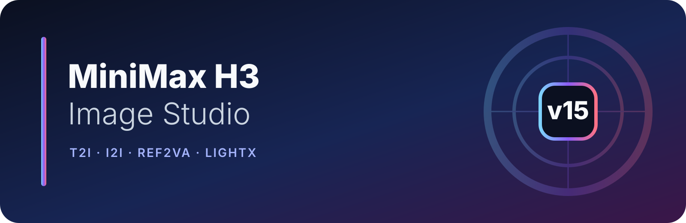
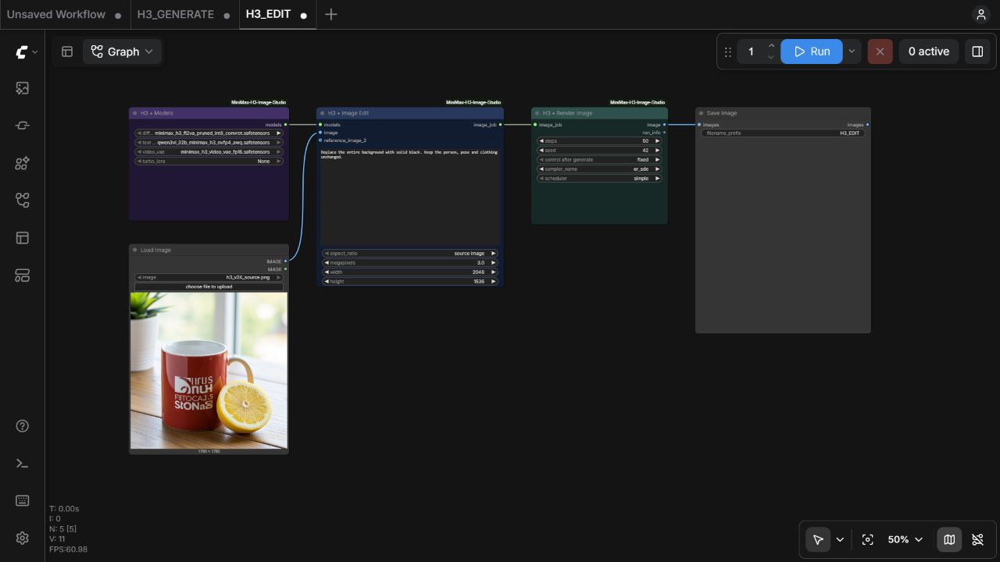

# MiniMax H3 Image Studio

MiniMax H3 **text-to-image and image editing** in ComfyUI. Four nodes, two starter workflows, one shared model setup. Multiple reference images are supported.

The new path samples **one latent frame** and includes the video-VAE decode technique from [Fizgig H3 Still](https://github.com/shootthesound/ComfyUI-Fizgig-H3-Still). That latent is repeated only during decoding, then one image is kept. No frame counts, frame selection or separate Fizgig installation.

Still experimental: prompt adherence, identity, typography and fine detail vary. The decoder targets lone-frame banding; it cannot guarantee artifact-free images or successful edits.

## Install and models

Use **ComfyUI 0.37.0 or newer**. Install Image Studio through ComfyUI Manager or clone this repository into `ComfyUI/custom_nodes/`. Restart ComfyUI and refresh the browser after updating.

Only three files are needed for the starting setup:

| Component | Starting file | Folder |
|---|---|---|
| H3 model | `minimax_h3_fl2va_pruned_int8_convrot.safetensors` | `models/diffusion_models/` |
| Text/vision encoder | `qwen3vl_32b_minimax_h3_nvfp4_awq.safetensors` | `models/text_encoders/` |
| **Video** VAE | `minimax_h3_video_vae_int8_convrot.safetensors` or your existing `minimax_h3_video_vae_fp16.safetensors` | `models/vae/` |

Download from [Comfy-Org/MiniMax-H3](https://huggingface.co/Comfy-Org/MiniMax-H3) using the [official ComfyUI guide](https://docs.comfy.org/tutorials/video/minimax/minimax-h3). Choose the quantization supported by your CUDA/PyTorch installation. Reuse files already on disk.

Following Fizgig's examples, both workflows start with FL2VA, including reference conditioning for editing. A separate REF2VA model is an optional comparison. No hybrid checkpoint, image VAE, audio VAE, Qwen refiner, decoder converter or model-download script is needed.

## Two workflows

Open **Templates → MiniMax H3 Image Studio**, or drag either JSON onto ComfyUI:

- [Generate](example_workflows/H3_GENERATE.json): `Models → Text to Image → Render Image → Save Image`.
- [Edit](example_workflows/H3_EDIT.json): add a `Load Image` connected to `Image Edit`.



Select the three files in **H3 • Models**. Write your prompt, choose aspect ratio and megapixels, then queue. **Render Image** exposes manual steps and seed. Changing only seed or steps reuses ComfyUI's cached prompt/reference preparation.

| Control | Starting point |
|---|---|
| Resolution | **3 MP**; 1 MP for a preview, 4–8 MP for larger output |
| Steps without a LoRA | **50**, from Fizgig's no-Turbo still example; lower manually for speed |
| Sampler / scheduler | **ER-SDE / simple**, under advanced controls |
| Edit aspect ratio | **source image**, keeping its proportions at the chosen output area |
| Exact dimensions | Select **custom pixels**, then set advanced width/height |

Sizes align to 32 pixels; MP uses ComfyUI's `1024²` convention. There is no 0.98/1 MP restriction. Larger canvases cost sampling memory and time; tiled decoding does not make the diffusion model fit every GPU.

## Editing and references

**Image Edit** combines image-to-image and reference editing. The source is `<Picture 1>`. Additional picture sockets grow as needed, up to nine pictures total. Each socket uses the first image of its input batch.

For a single source, write an ordinary instruction:

```text
Replace the entire background with solid black. Keep the woman, her pose and clothing unchanged.
```

For multiple pictures, assign their roles explicitly:

```text
Keep the person and clothes from <Picture 1>. Use the pose from <Picture 2>
and the room from <Picture 3>.
```

References are encoded separately from the generated still. There is no fixed frame-zero source anchor, hidden preservation-strength prompt or misleading denoise slider. This avoids returning a locked source frame, but the model can still miss an instruction.

## Optional faster recipe

The default requires no LoRA. One optional adapter is supported: `minimax_h3_turbo_v4_step600_ema.safetensors` from [Larry's H3 Turbo repository](https://huggingface.co/larryvrh/MiniMax-H3-Turbo-Lora), placed in `models/loras/`.

Select it in **Models → advanced → turbo_lora**, then set **steps to 20**. The loader applies strength **0.38**, matching [Fizgig's still example](https://github.com/shootthesound/ComfyUI-Fizgig-H3-Still#is-there-an-example-workflow). Steps remain editable. This community still recipe differs from Larry's strength-1, 4–8-step video guidance; an old LightX adapter is not interchangeable.

## Earlier versions

Reopen a new template after updating; saved canvases do not migrate automatically. Old Image Studio nodes remain registered as deprecated compatibility definitions and keep their original behavior.

Old workflows and measurements remain on GitHub in `examples/` and the [historical v23 guide](docs/legacy-v23.md). They are no longer starter examples or included in the Registry package. The Qwen detail refiner is also historical.

## Feedback

Missing model choices: check folders, restart ComfyUI and refresh. Decoder errors: use the official H3 **video** VAE and current ComfyUI. Out of memory: lower megapixels or use supported quantized weights; native ComfyUI manages loading and offloading.

This project was coded with AI assistance. The author is not an experienced programmer; suggestions and bug reports are welcome. Include the traceback, workflow, versions, GPU/VRAM, model filenames, dimensions, steps and seed in a [GitHub issue](https://github.com/astropuzzo/ComfyUI-MiniMax-H3-Image-Studio/issues).

See [validation](VALIDATION.md), [changelog](CHANGELOG.md) and [contributing](CONTRIBUTING.md). Image Studio code is [Unlicense](LICENSE). The adapted Fizgig decoder keeps its MIT license and attribution in [third-party notices](THIRD_PARTY_NOTICES.md). Models retain their own licenses.
