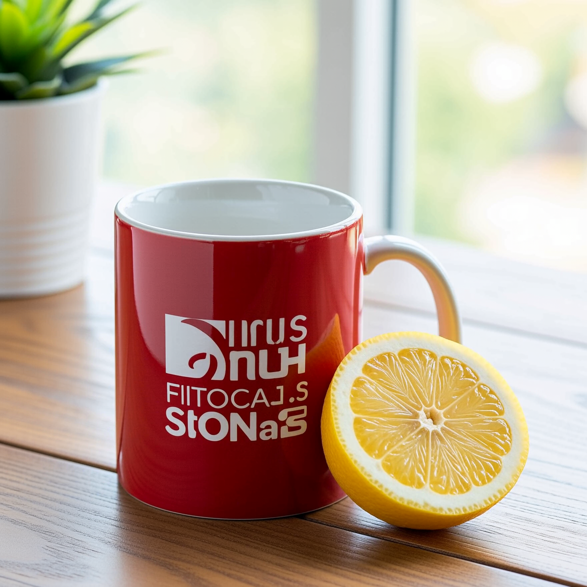
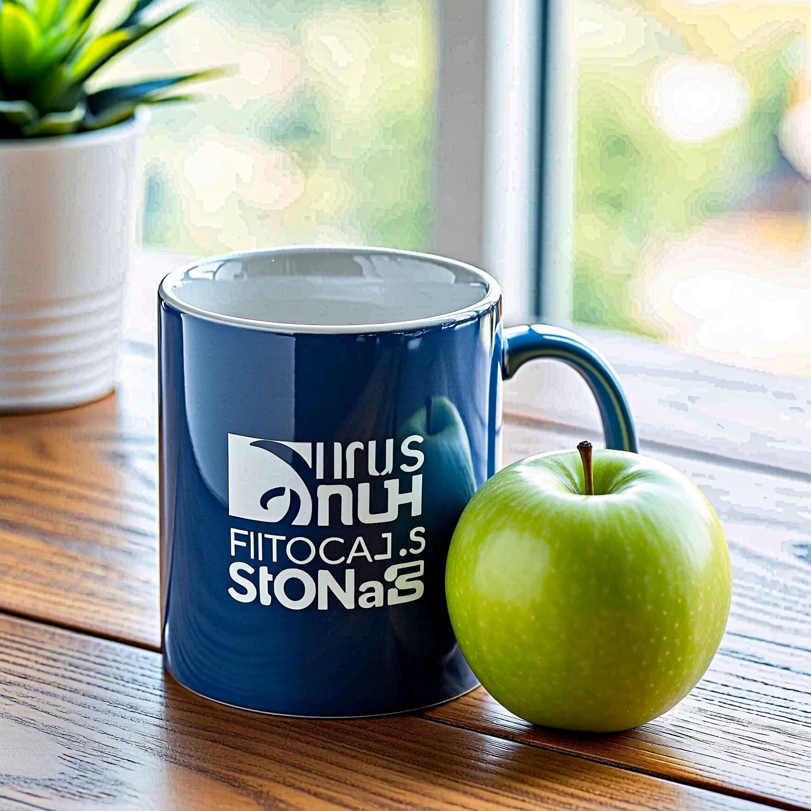

# v24 validation — 30 September 2026

Setup: Windows, RTX 4090 **24 GB VRAM**, **64 GB system RAM**, ComfyUI **0.37.0**, frontend **1.52.7**, Python **3.12.10**, PyTorch **2.14.0+cu130**. Standard PyTorch attention, native dynamic VRAM/offloading; only Image Studio enabled. No SageAttention, refiner, upscaler or cache patch.

Models: `minimax_h3_fl2va_pruned_int8_convrot.safetensors`, `qwen3vl_32b_minimax_h3_nvfp4_awq.safetensors`, `minimax_h3_video_vae_fp16.safetensors`. **No LoRA and no model downloads.** All tests sampled one H3 video latent frame plus its required short audio latent; the VAE's five-frame group was created only during decoding. Each 3 MP benchmark below saved exactly one 1760×1760 image.

## Local image tests

| Test | Steps / seed | Server execution time | Observation |
|---|---|---|---|
| Generate a red mug with a lemon on a wooden table | 50 / 42 | 41.91 s | Detailed mug, lemon and wood; the model invented illegible logo text. |
| Edit that source: blue mug, replace lemon with green apple | 50 / 42 | 117.77 s | Both requested edits are visible and framing is similar. Background gradients show obvious posterization; the decode technique does not eliminate every artifact. |
| Same edit, change steps and seed only | 20 / 43 | 47.32 s | The model loader, reference preparation and Load Image nodes were reused from ComfyUI's graph cache. |

Times come from the server's execution-start/success timestamps, not an average or a comparison against previous versions. The first run includes initial model loading. Editing has extra reference encoding and attention cost. Lower step counts do not establish equivalent quality.

Generated source (left) and requested edit (right), both at 3 MP / 50 steps:

| Generated source | Edited output |
|---|---|
|  |  |

The optional Larry v4 strength-0.38 / 20-step still recipe follows Fizgig's example and was **not tested locally**: that adapter was not installed. It is not the default.

## Checks

- 32 CPU tests passed, including existing node regressions and new checks for one-frame latent/audio shapes, ordered references, nine-picture handling, absence of a source keyframe anchor, larger/custom resolutions, VAE denormalization and single-image output storage.
- Live ComfyUI registered the four new nodes and marked the old nodes deprecated.
- Two new UI/API workflows and twelve historical UI/API/metadata-PNG sets passed structural validation.
- Both starter templates opened correctly in the native Templates library, which shows only these two new entry points. Generate was also executed from the canvas at 3 MP / 50 steps and saved one image successfully (40.33 s).
- A live two-reference edit completed through native V3 autogrow inputs at 1 MP / 12 steps. This was an input-routing smoke test, not a quality benchmark.
- Seed/step cache reuse was confirmed in live execution history, not inferred from the graph layout.

This limited product-image test does not establish portrait identity, pose transfer, text accuracy, all resolutions, every GPU or general editing reliability. The visual artifact in the edit remains a known limitation.

## Sources and attribution

- [Fizgig H3 Still](https://github.com/shootthesound/ComfyUI-Fizgig-H3-Still), commit `10d5171`: one-frame latent, grouped video-VAE decode, shared FL2VA edit example and still sampling starting recipes.
- [ComfyUI VAE optimization announcement](https://blog.comfy.org/p/making-the-minimax-h3-video-vae-2x): current native VAE optimizations. No separate benchmark of that advertised speedup was performed here.
- [Official H3 model files](https://huggingface.co/Comfy-Org/MiniMax-H3): supported starting quantizations.

The adapted decoder remains MIT licensed; see [third-party notices](../THIRD_PARTY_NOTICES.md).
